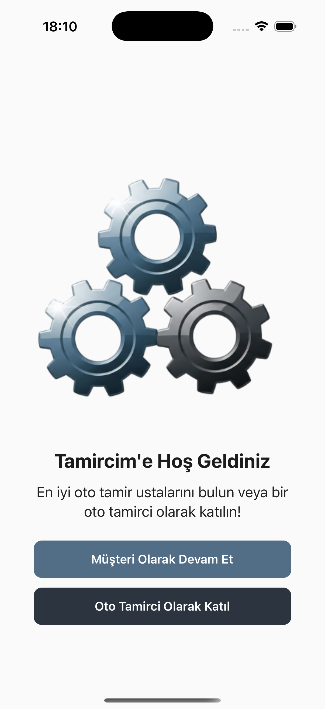
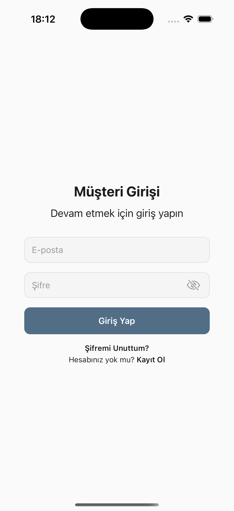
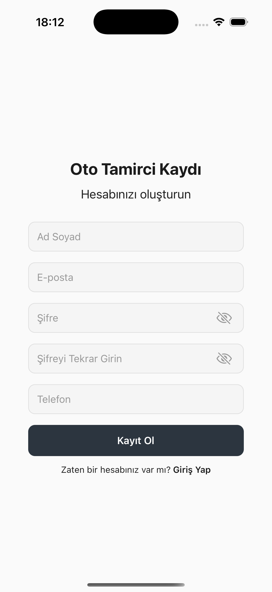
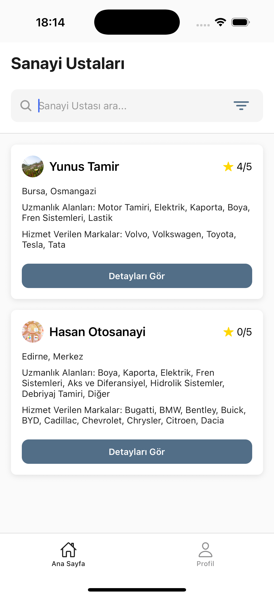
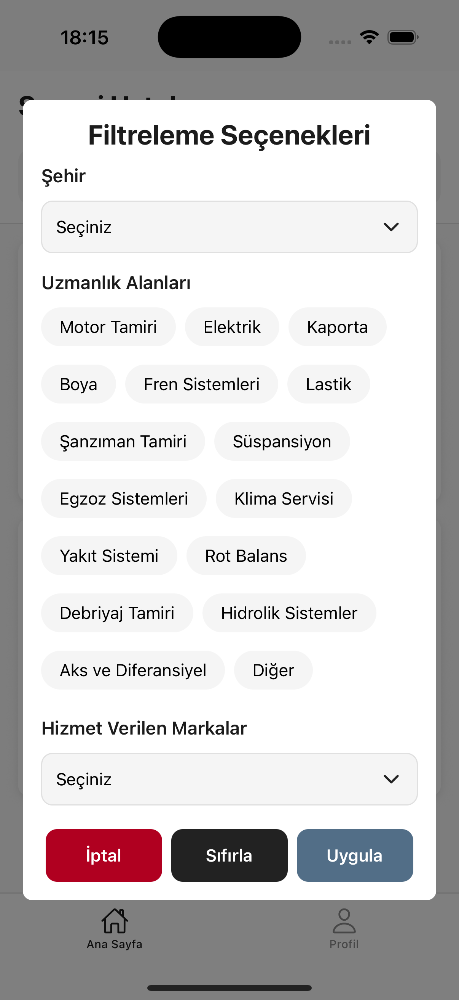
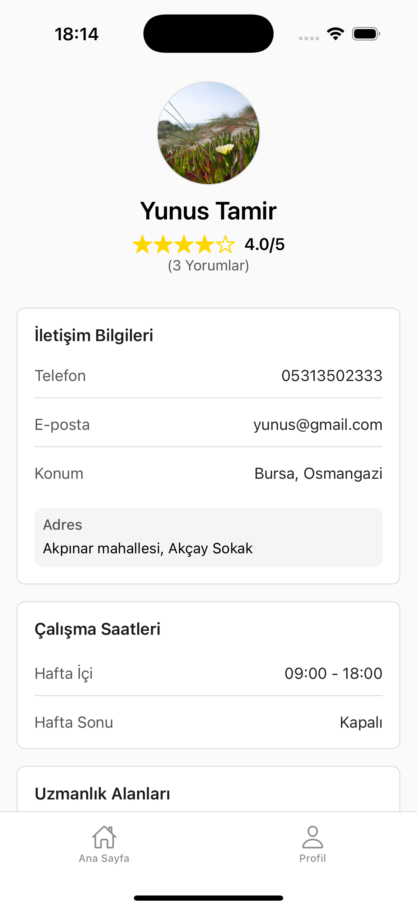
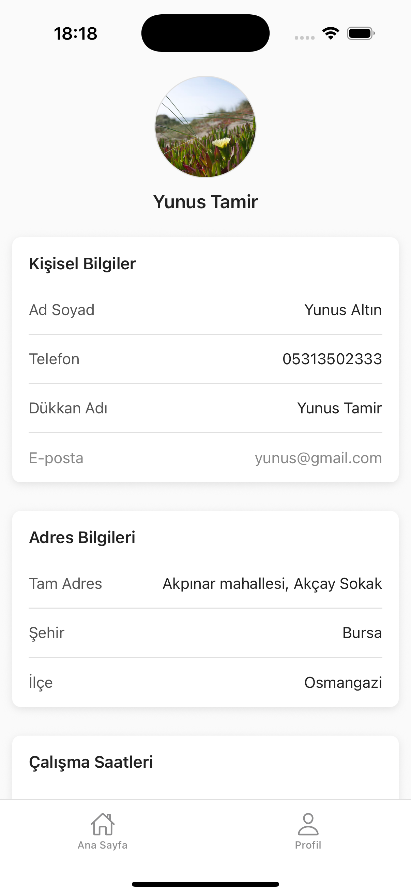
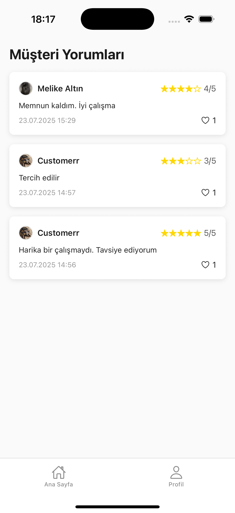

# Tamircim - Otosanayi Bulma Uygulaması

Modern ve kullanıcı dostu bir React Native Expo uygulaması. Müşteriler en yakın tamircileri bulabilir, tamirciler de hizmetlerini tanıtabilirler.

## 🚀 Özellikler

- **İki Kullanıcı Tipi**: Müşteri ve Tamirci hesapları
- **Akıllı Arama**: Şehir, ilçe, uzmanlık alanına göre filtreleme
- **Değerlendirme Sistemi**: 5 yıldızlı puanlama ve yorumlar
- **Çoklu Dil Desteği**: Türkçe ve İngilizce
- **Offline Destek**: İnternet bağlantısı takibi
- **Modern UI/UX**: Responsive tasarım ve animasyonlar

## 📱 Ekran Görüntüleri

### Kimlik Doğrulama

| Giriş Seçimi                                                 | Müşteri Girişi                                                  | Tamirci Kayıt                                                      |
| ------------------------------------------------------------ | --------------------------------------------------------------- | ------------------------------------------------------------------ |
|  |  |  |

### Müşteri Deneyimi

| Ana Sayfa                                                      | Tamirci Arama                                                   | Tamirci Detayı                                                   |
| -------------------------------------------------------------- | --------------------------------------------------------------- | ---------------------------------------------------------------- |
|  |  |  |

### Tamirci Paneli

| Tamirci Ana Sayfa                                              | Profil Düzenleme                                              | Yorumlar                                                 |
| -------------------------------------------------------------- | ------------------------------------------------------------- | -------------------------------------------------------- |
|  |  |  |

## 🛠️ Teknoloji Stack

- **Framework**: React Native 0.79.5
- **Platform**: Expo SDK 53
- **Routing**: Expo Router 5 (File-based)
- **State Management**: Zustand
- **Forms**: React Hook Form + Zod validation
- **API**: Axios
- **Dil Desteği**: i18next
- **Animasyonlar**: React Native Reanimated

## 📦 Kurulum

```bash
# Projeyi klonlayın
git clone [repository-url]
cd otosanayi-frontend

# Bağımlılıkları yükleyin
npm install

# Geliştirme sunucusunu başlatın
npm start

# Platform bazlı çalıştırma
npm run android
npm run ios
npm run web
```

## 🔧 Konfigürasyon

### API Ayarları

`lib/axios.js` dosyasında backend URL'ini güncelleyin:

```javascript
baseURL: "http://your-backend-url:3000/api/v1";
```

### Dil Ayarları

Varsayılan dil cihaz diline göre otomatik ayarlanır. Manuel değişiklik için `config/i18n.js` dosyasını düzenleyin.

## 📂 Proje Yapısı

```
otosanayi-frontend/
├── app/                    # Expo Router sayfaları
│   ├── (auth)/            # Giriş/Kayıt sayfaları
│   ├── (customer)/        # Müşteri sayfaları
│   └── (mechanic)/        # Tamirci sayfaları
├── components/            # Yeniden kullanılabilir bileşenler
├── constants/             # Renkler, temalar, veriler
├── hooks/                 # Özel React hooks
├── store/                 # Zustand state management
├── api/                   # API fonksiyonları
└── locales/              # Çoklu dil dosyaları
```

## 🎨 Tasarım Sistemi

- **Renk Paleti**: Minimal siyah-gri tonları
- **Tipografi**: Inter font ailesi
- **Spacing**: 4px grid sistemi
- **Bileşenler**: Modüler ve yeniden kullanılabilir

## 🌟 Gelecek Özellikler

- [ ] Push bildirimleri
- [ ] Harita entegrasyonu
- [ ] Randevu sistemi
- [ ] Ödeme entegrasyonu
- [ ] Fotoğraf galerisi

## 📄 Lisans

Bu proje MIT lisansı altında lisanslanmıştır.

---

**Geliştirici**: [Your Name]  
**E-posta**: [your-email]  
**Versiyon**: 1.0.0
